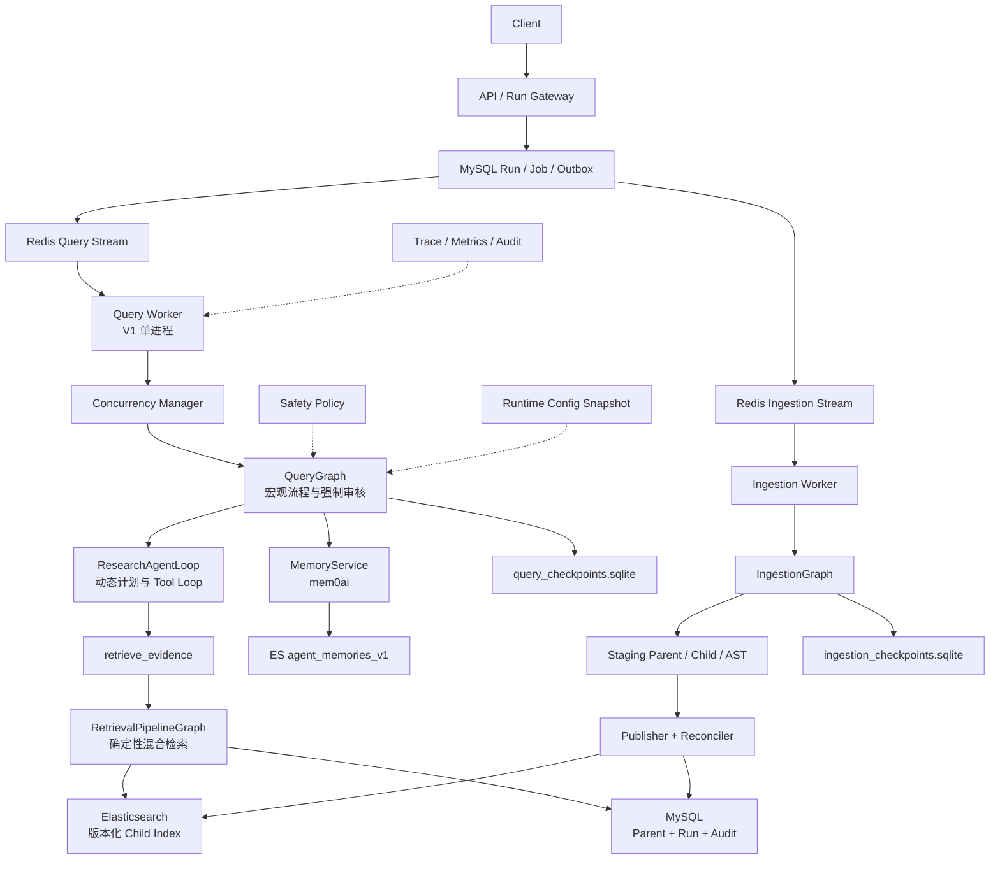
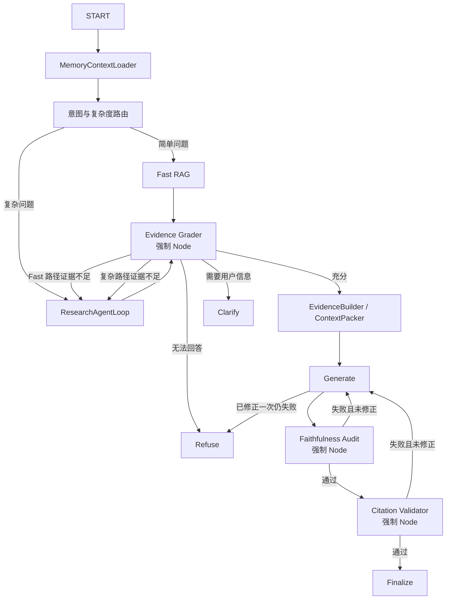
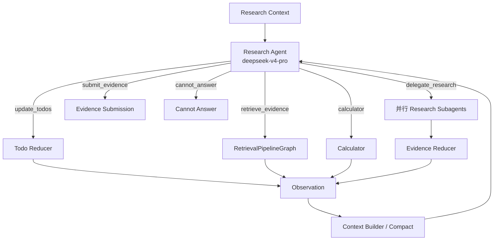
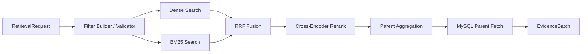
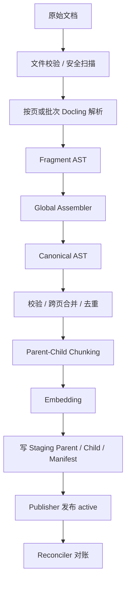
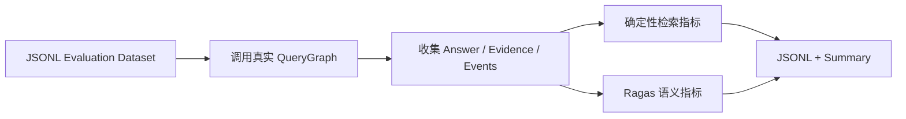

# 生产级 Agentic RAG 设计文档

> 日期：2026-08-04  
> 状态：已完成第二轮生产架构审核，等待书面复审
> 实现语言：Python  
> 编排框架：LangGraph

## 1. 摘要

本项目构建一个本地启动、面向企业文档问答和复杂研究任务的生产级 Agentic RAG 系统。系统同时支持：

- 简单问题的传统 RAG 快路径；
- 多跳、多轮检索和动态计划；
- 并行 Research Subagent；
- PDF、扫描 PDF、文本和 Excel 摄取；
- Parent-Child 混合检索；
- 长期记忆与会话工作记忆；
- 强制证据、忠实度和引用审核；
- Checkpoint 恢复、幂等重放、有限重试和降级；
- 持久化 Query Run、取消、恢复、进度事件与并发背压；
- 跨 MySQL、Redis、ES 的任务补投、版本发布与对账；
- 运行配置快照、RAG 内容安全边界和受控证据上下文；
- 原始消息、Tool Event 和审核事件审计；
- 请求内审核、在线质量监控与离线 RAG/AgentLoop 基准评测。

系统遵循三层职责边界：

1. QueryGraph 控制不能由模型随意决定的宏观流程。
2. ResearchAgentLoop 动态规划检索方向和 Tool 使用顺序。
3. Tools 与确定性 Subgraph 执行边界清晰的原子能力。

设计原则是“生产级，但不过度设计”：V1 定位为可信环境中的单机生产版本，补齐正确性、隔离、恢复、背压、安全和评测闭环；未来能力通过少量接口预留，不提前实现复杂基础设施。

## 2. 目标与非目标

### 2.1 V1 目标

- 用户少、无独立鉴权系统时，仍通过 `user_id` 实现数据和记忆隔离。
- 支持默认用户 `default_user`，但所有数据访问都必须显式携带用户范围。
- 使用 LangGraph 实现 QueryGraph、ResearchAgentLoop、RetrievalPipelineGraph 和 IngestionGraph。
- 使用 DeepSeek 主模型和轻量模型完成路由、Agent、生成和审核。
- 使用 ES 完成 Dense 与 BM25 检索，MySQL 保存 Parent 和审计数据。
- 使用 Docling 统一文档解析结果并建立 Canonical AST。
- 使用 mem0ai 作为长期记忆实现，不复制或重写 Mem0 核心。
- 使用 Redis Streams 实现简单、可恢复的 Query 与摄取任务通知队列。
- 将 Query Run 建模为持久化资源，由本地 Query Worker 异步执行，支持状态查询和取消。
- 使用保守的进程内并发上限保护 DeepSeek、ES、MySQL 和本地 Cross-Encoder。
- 所有检索内容和长期记忆均按不可信数据处理，不能改变系统指令或越权调用 Tool。
- 提供请求内质量保护、在线运行指标与反馈，以及可复现的离线检索、生成和 AgentLoop 评测。

### 2.2 V1 非目标

- 不使用 Docker、Kubernetes 或微服务拆分。
- 不使用知识图谱，也不实现 Knowledge Graph Tool。
- 不允许 Agent 直接执行 SQL，不提供 `query_mysql` Tool。
- 不将 Metadata Search 作为独立召回通道。
- 不实现 Token 或成本预算决策节点。
- 不实现 Milvus Adapter，只保留 `VectorIndex` 接口。
- 不实现认证、RBAC、完整 HITL UI、通用事件总线、缓存体系、自动扩缩容或复杂熔断平台。
- 不实现多机高可用；V1 明确使用单个 Query Worker 和单个 Ingestion Worker。
- 不实现复杂的记忆衰减算法或重新实现 Mem0 的存储、检索与冲突处理。

## 3. 技术栈

| 能力 | V1 选择 |
|---|---|
| 语言 | Python |
| API | FastAPI |
| Graph / Agent 编排 | LangGraph |
| 主模型 | DeepSeek `deepseek-v4-pro` |
| 轻量模型 | DeepSeek `deepseek-v4-flash` |
| Embedding | Qwen `text-embedding-v3`，1024 维 |
| Reranker | `BAAI/bge-reranker-v2-m3` Cross-Encoder |
| 文档解析 | Docling |
| 向量与 BM25 | 本地 Elasticsearch，`localhost:9200` |
| Parent 与审计数据 | 本地 MySQL |
| Checkpointer | SQLite，单 Worker 写入，WAL 模式 |
| Query 与摄取任务通知 | 本地 Redis Streams，`127.0.0.1:6379` |
| 长期记忆 | `mem0ai==2.0.12`，进程内库接入 |
| RAG 评测 | Ragas + 确定性检索指标 |

ES 本地启动方式：

```bash
cd ~/Downloads/elasticsearch-8
./bin/elasticsearch
```

## 4. 总体架构



### 4.1 三层职责

#### 第一层：Graph

Graph 固定控制：

- 请求路由；
- Research 循环上限；
- 节点超时与有限重试；
- 强制审核；
- 错误降级与拒答路径；
- Checkpoint 持久化；
- 最终结束条件。

V1 不实现 Token 或成本预算判断，但保留固定安全上限。

#### 第二层：ResearchAgentLoop

AgentLoop 动态决定：

- 如何拆解问题；
- Todo 如何创建、修改、拆分和合并；
- 下一步缺少什么证据；
- 使用哪个检索请求；
- 是否并行委派 Research Subagent；
- 是否改变检索方向；
- 何时提交证据或无法回答。

#### 第三层：Tools 与确定性 Subgraph

Agent 可见的动作分为两类。

Tool 调用：

- `update_todos`
- `retrieve_evidence`
- `delegate_research`
- `calculator`

终止动作：

- `submit_evidence`
- `cannot_answer`

其中 `retrieve_evidence` 是 Agent 视角的高层 Tool，内部由 RetrievalPipelineGraph 实现。

Agent 不直接看到：

- `dense_search`
- `bm25_search`
- `rrf_fusion`
- `rerank`
- `parent_fetch`
- ES 或 MySQL 客户端

这些能力是 RetrievalPipelineGraph 的内部 Node 或 Port。

三层职责描述的是单次 QueryGraph 执行内部。Run Gateway、Outbox、Worker Lease 与 ConcurrencyManager 位于 Graph 外部，构成执行控制面；它们决定“某个 Run 何时、由谁、以多少并发运行”，但不替代 Graph 对路由、循环、审核和结束条件的确定性控制。

### 4.2 本地进程边界

V1 只运行三个本地进程：

```text
API / Run Gateway
Query Worker
Ingestion Worker
```

- API 负责参数校验、用户范围注入、创建 Run 或 Job、查询状态、取消和进度事件，不直接长期占用请求线程执行 Research。
- Query Worker 从 Redis Stream 接收通知，在 MySQL 中 Claim Run 后执行 QueryGraph。
- Ingestion Worker 从独立 Redis Stream 接收通知并执行 IngestionGraph。
- `ModelGateway`、`ConcurrencyManager`、`SafetyPolicy`、`EvidenceBuilder` 和 `Reconciler` 都是进程内组件，不拆为网络服务。
- MySQL 中的 Run、Job 与 Outbox 是状态真相；Redis Stream 只负责可重复投递的执行通知。

### 4.3 Query Run 生命周期

```text
queued -> running -> completed
                  -> failed
queued/running -> cancel_requested -> cancelled
```

```text
Stream: agenticrag:jobs:query
Group:  agenticrag-query-workers
Dead:   agenticrag:jobs:query:dead
```

创建 Run 与写入 Outbox 在同一个 MySQL 事务中完成。API 进程内的轻量 Outbox Dispatcher 将通知写入 Redis，Query Worker 再通过 Lease Claim Run；Redis 重复投递不会重复创建 Run。服务端保证同一 `user_id + thread_id` 最多只有一个活动 Run，避免并发写同一个 Checkpoint Thread。Worker 崩溃由 Lease 和 `XAUTOCLAIM` 接管；默认最多 Claim 执行 3 次，耗尽后进入 Dead Stream 并将 Run 标记为 `failed`。

取消是协作式取消：API 将 Run 标记为 `cancel_requested`，Worker 在进入节点、发起 Tool 调用和启动 Subagent 前检查取消状态，并向正在运行的 Subagent 传播取消。已完成的幂等副作用不回滚，Run 最终进入 `cancelled`。

### 4.4 运行时横切组件

- `ModelGateway`：封装 DeepSeek 调用、结构化输出校验、超时、重试和实际模型 ID 记录；它是 Python Port/Adapter，不是独立服务。
- `ConcurrencyManager`：为 Run、LLM 调用、Subagent 和 Cross-Encoder 提供进程内 Semaphore 与公平排队。
- `RuntimeConfigSnapshot`：在 Run 创建时固化 Graph、Prompt、模型、Embedding、Reranker、检索参数和索引代际。
- `SafetyPolicy`：验证上传内容、检索上下文、Memory 与 Tool 输入，将外部内容始终视为数据而不是指令。
- `TraceRecorder`：将 Run、Node、模型、Tool、检索与审核组织为父子 Span，并继续使用 MySQL Event 和结构化日志落盘。

### 4.5 部署与安全边界

V1 假设调用方和本机环境可信。`user_id` 用于数据范围隔离，但不是身份凭证；若 API 暴露给不可信网络，必须先增加认证并由服务端身份映射生成 `user_id`，不能相信客户端自报的用户 ID。完整认证和 RBAC 仍属于后续迭代。

## 5. QueryGraph



Clarify 与 Refuse 路径不生成知识性答案，因此不进入 Faithfulness 与 Citation 审核；所有正常答案必须经过三个审核阶段。

### 5.1 路由

路由使用 `deepseek-v4-flash` 输出结构化结果：

```text
route: fast_rag | research
normalized_query: string
reason_code: string
```

V1 不设置单独的结构化 SQL 路由。结构化 Metadata 只作为 Dense 与 BM25 的 Filter；MySQL 只由内部 Repository 获取 Parent。

### 5.2 Fast RAG

Fast RAG 只执行一次 RetrievalPipelineGraph。Evidence Grader 判定不足时自动升级到 ResearchAgentLoop，而不是直接生成低质量答案。

### 5.3 状态

`QueryState` 只保存 JSON 可序列化数据：

```text
request
run_id
messages
memory_context
route
research
evidence
packed_context
runtime_config_snapshot
answer
audit_results
revision_count
errors
termination_reason
```

`ResearchState`：

```text
plan_revision
todos
discovered_entities
retrieval_history
evidence_ids
last_observation
submitted
```

State 不保存数据库连接、ES Client、DoclingDocument、Embedding 数组、Cross-Encoder 对象或完整 Parent 大文本。大对象写入存储或本地 Artifact，State 只保留引用。Run 创建后配置快照不可变，恢复执行时必须继续使用同一个快照，不能静默切换 Prompt、模型或检索参数。

## 6. ResearchAgentLoop 与 Multi-Agent



这是一个真正的 Agent Loop：每一轮都由 LLM 根据当前观察选择动作，Tool 或 Subgraph 返回 Observation 后再次进入 Agent，而不是按固定检索步骤一次性结束。

### 6.1 动态 Todo

Todo 状态：

```text
pending | in_progress | completed | blocked | skipped
```

规则：

- Agent 可以在循环内首次创建计划，也可以根据证据动态修改计划。
- Todo 可追加、重试或跳过；当前简单 DAG 不支持直接改写已有边或合并任务，详细契约见 [AgentLoop Todo DAG](./2026-09-08-research-agentloop-todo-dag-design.md)。
- `completed` 必须包含 Evidence ID 或明确的非检索结果引用。
- 依赖项完成前不能进入 `in_progress`。
- Todo Reducer 拒绝依赖环和非法状态转换。
- Subagent 只能修改分配给自己的 Todo；Supervisor 管理全局 Todo。
- Todo 变化以 `TODO_UPDATED` Event 追加记录。

不在进入 AgentLoop 前设置独立静态 Planner Node，避免计划与检索观察脱节。

### 6.2 并行 Research Subagent

- Supervisor 仅在多个 Todo 均 ready 时，通过 `SubagentDispatcher` 的 asyncio 任务并行启动检索 worker。
- 当前 Subagent 是受限检索 worker，接收解析后的查询、Filter、记忆摘要、当前 Evidence Manifest 和依赖结果，不再调用一个独立 LLM Loop。
- Calculator 由 Supervisor 按 Todo 调用；Subagent 不能生成最终用户答案。
- Subagent 返回结构化 Evidence 和 Todo 结果，由 Evidence Reducer 去重合并。
- Subagent 使用 per-invocation 状态命名空间，不共享可变 Graph State；Reducer 按稳定 Evidence ID 确定性合并。
- 单次 Run 默认最多并行 3 个 Subagent。Join 超时后保留已完成结果，将未完成 Todo 标记为 `blocked`，由 Supervisor 决定继续、改写或结束。
- Supervisor 结束、Run 取消或总超时后，所有未完成 Subagent 必须收到取消信号，不能脱离父 Run 继续执行。
- 单个 Run 内部的 Supervisor 通过 asyncio 委派 Subagent，不经过 Redis；LangGraph 在每个 Supervisor 动作之间保存 checkpoint，Redis Query Stream 只负责把整个 Run 分配给 Query Worker。

### 6.3 Context Compact

每次调用 Research Agent 前构建受控上下文，保留：

- 系统约束与原始问题；
- MemoryContext 摘要；
- 未完成 Todo；
- 最近 Observation；
- Evidence Manifest；
- Evidence Grader 返回的缺口。

较早的 Tool 输出、已完成 Todo 细节和重复检索结果由 `deepseek-v4-flash` 压缩。压缩是上下文窗口安全机制，不是成本预算决策；完整原始消息与 Tool Event 已写入 MySQL，可用于审计和重放。

## 7. RetrievalPipelineGraph

Agent 只提交结构化 `RetrievalRequest`：

```text
query
search_type
document_ids
content_types
date_range
top_k_override
```

`user_id` 与有效版本约束由服务端注入，Agent 不能提供或覆盖。`top_k_override` 只能在 Graph 配置的上下限内调整。



### 7.1 Filter 规则

以下 Filter 同时作用于 Dense 和 BM25：

- 强制：`user_id`
- 强制：`is_active=true`
- 可选：`search_type`
- 可选：`document_id`
- 可选：`content_type`
- 可选：文档标签与日期范围

不存在第三路 Metadata Recall，也不允许两路召回使用不同的用户范围。

### 7.2 默认检索参数

```text
Dense Top K       = 40
BM25 Top K        = 40
RRF 保留          = 30
Cross-Encoder 输入 = 30
重排后 Child       = 10
每个 Parent Child  = 最多 2 个
最终 Parent Top K   = 6
```

这些是 V1 基线参数，后续通过离线评测调优，不实现在线自动调参。

### 7.3 Cross-Encoder

默认模型：`BAAI/bge-reranker-v2-m3`。

- 本地进程启动时加载一次。
- 通过 `Reranker.rerank(query, candidates)` 接口隔离模型实现。
- Reranker 超时或不可用时使用 RRF 顺序降级，并记录 `rerank_degraded=true`。
- 不单独部署 Reranker 服务。

### 7.4 向量数据库抽象

```text
VectorIndex.search(query_vector, filter, top_k)
LexicalIndex.search(query_text, filter, top_k)
```

V1 两个接口都由 ES Adapter 实现。未来 Milvus 只替换 `VectorIndex`，BM25 可继续留在 ES，Graph 和 Tool 契约保持不变。

### 7.5 EvidenceBuilder / ContextPacker

RetrievalPipelineGraph 返回结构化 `EvidenceBatch`，不直接拼接 Generate Prompt。EvidenceBuilder 在 Evidence Grader 判定充分后执行确定性装配：

- 以 `parent_id + document_version_id` 去重，并保留命中的 Child、RRF 分数、Reranker 分数和 AST Locator；
- 为每个 Evidence 生成当前 Run 内稳定且不可伪造的 Evidence ID；
- 默认总证据容量上限为 12000 Tokens，并为系统指令、问题、Memory 和回答预留模型上下文；该上限是容量保护，不参与成本路由；
- 超出容量时优先保留高分和覆盖不同 Todo 的 Parent，再围绕命中 Child 对超长 Parent 做结构感知截取；
- 非明确限定单文档的问题，默认每个文档最多贡献 3 个 Parent，避免单一文档挤占全部上下文；
- Memory、用户问题、系统约束和检索证据使用不同结构字段与边界标记，检索内容不能解释为系统指令；
- 输出 `EvidenceManifest` 与 `PackedContext`；只有 Manifest 中实际进入 Prompt 的 Evidence 才允许被最终答案引用。

容量上限由 `RuntimeConfigSnapshot` 固化，后续根据目标模型上下文窗口和离线评测调整。

## 8. Parent-Child Chunking

采用分层混合策略：

- Parent：Canonical AST 结构语义 Chunking。
- Child：Docling HybridChunker 的结构感知、Token 限制 Chunking。
- 递归或行级切分：仅用于超长原子块兜底。
- V1 不使用 Embedding 或 LLM 相似度驱动的语义边界判断。

### 8.1 Parent 规则

- 标题章节、表格、图片说明和 Excel 逻辑数据区是语义边界。
- 同一标题下相邻 AST 节点依次合并。
- 目标长度 `1200-1800 tokens`，最大约 `2400 tokens`。
- 不跨一级主题边界，不混合表格与正文。
- 跨页连续段落在 Global Assembler 中先合并，再参与 Parent 构建。
- 超大表格按行组拆 Parent，并重复表头。

### 8.2 Child 规则

- Child 不跨 Parent。
- 使用 Docling HybridChunker。
- Contextualized Child 最大 `384 tokens`，为 Query、标题路径和 Cross-Encoder 特殊 Token 留空间。
- 检索文本包含标题路径、表格标题或图片说明以及正文。
- 同标题下过小的相邻块可以合并。
- 表格分块重复表头。
- 默认不增加文本重叠；Parent Fetch 已恢复完整上下文。若离线评测证明存在明显边界召回问题，再为普通长文本增加小幅重叠。

### 8.3 超长原子块兜底

普通文本顺序：

```text
段落 → 换行 → 句末标点 → 分号 → 逗号 → Token 硬切
```

表格、代码与日志优先保持行完整，使用行级 Token Chunking。

## 9. 文档摄取架构

IngestionGraph 独立于 QueryGraph：



### 9.1 Canonical AST

Fragment AST 与 Canonical AST 都以 `DoclingDocument` 为核心数据模型，项目只增加薄 Envelope：

```text
document_id
document_version_id
user_id
source_type
source_uri
content_hash
parser_version
pipeline_version
created_at
```

Canonical AST 必须满足：

- 全局阅读顺序已确定；
- 跨页段落、表格和列表已合并；
- 重复页眉、页脚和 OCR 重复内容已处理；
- 标题层级、页码、Bounding Box 与来源可追踪；
- Schema 与引用完整性校验通过。

Canonical AST 以 JSON Artifact 保存在本地文件系统，MySQL 保存路径和版本信息。

Artifact 使用版本化目录和原子重命名发布；MySQL 同时保存文件 Hash。原始文件、Canonical AST 和派生 Manifest 必须能够通过 `document_version_id` 互相追踪。临时文件不作为可恢复状态来源。

### 9.2 文档类型

- 文本 PDF：Docling 文本与布局解析。
- 扫描 PDF：Docling OCR 管线。
- Excel：转换为工作表、逻辑区域、表格和行级 AST。
- 纯文本：转换为统一 DoclingDocument 结构。

不同文档类型从 Fragment AST 之后共用同一条 Assembler、Chunking 与 Indexing 管线。

### 9.3 上传与内容安全

- 服务端同时校验扩展名、声明 MIME、实际文件签名、文件大小和页数上限，拒绝路径穿越、压缩炸弹和不支持的嵌套文件。
- OCR 与解析结果执行不可见 Unicode、异常隐藏文本和提示注入启发式扫描；扫描结果只决定 `accepted | quarantined | rejected`，不能让文档内容改变扫描规则。`accepted` 进入 `building`，`quarantined` 保持隔离，`rejected` 转为 `failed` 并记录原因。
- 被隔离版本不可进入 Chunking 和索引发布；V1 由可信本地操作者通过显式 Version ID 的审核 CLI 执行批准或拒绝，批准后重新入队，不提供绕过扫描的自动发布路径。
- 检索到的正文、表格、代码和 Memory 均放入带来源的 Data Envelope，任何“忽略系统指令”“调用某工具”等内容按普通文档文本处理。

### 9.4 Redis Streams 摄取队列

不使用 Celery、Dramatiq、RQ 或 ARQ。

```text
Stream: agenticrag:jobs:ingestion
Group:  agenticrag-ingestion-workers
Dead:   agenticrag:jobs:ingestion:dead
```

消息只包含 `job_id` 和入队时间；MySQL `ingestion_jobs` 是任务真实状态来源。创建 Job 与 `task_outbox` 记录使用同一个 MySQL 事务，Dispatcher 负责 `XADD` 并将 Outbox 标记为已发送，避免 MySQL 成功但 Redis 通知丢失。

Worker 流程：

1. `XREADGROUP` 读取通知。
2. 在 MySQL 中原子 Claim Job 并写 Lease。
3. 周期更新 Heartbeat。
4. 使用固定 `thread_id=ingestion:{job_id}` 运行或恢复 IngestionGraph。
5. 更新 Job 状态后 `XACK`。
6. Lease 过期任务通过 `XAUTOCLAIM` 和 MySQL 原子 Claim 被重启后的 Worker 接管；未来多 Worker 时契约保持不变。
7. 默认最多执行 3 次；确定性输入错误直接失败，耗尽重试的任务写入 Dead Stream 并在 MySQL 标记 `failed`。

### 9.5 Publisher 与 Reconciler

Publisher 只发布已生成完整 Manifest 的版本。Manifest 至少包含 Canonical AST Hash、Parent 数、Child 数、Embedding 版本和 ES Index Generation。

Reconciler 是 Ingestion Worker 内的周期任务，不单独部署进程：

- 补投长期处于 `queued` 且 Outbox 未发送的 Job；
- 回收 Lease 过期的 `running` Job；
- 检查长期处于 `building` 的版本及 Parent、Child、Artifact Manifest 一致性；
- 完成可安全重试的激活或失活操作；
- 无法自动恢复的版本标记为 `quarantined` 或 `failed`，保持旧 active 版本可检索；
- 文档删除后确认 MySQL Parent、ES Child 和 Artifact 均已失效或删除，并记录对账事件。

## 10. 数据存储

### 10.1 MySQL 核心表

#### `documents`

```text
id
user_id
source_type
filename
mime_type
content_hash
status: processing | active | failed | deleted
active_version_id
source_trust: untrusted | trusted_curated
created_at
updated_at
```

上传文档默认 `source_trust=untrusted`；`trusted_curated` 只能由本地可信配置或审核 CLI 设置，并且只影响隔离审核优先级，不能让文档内容获得系统指令权限。

#### `document_versions`

```text
id
document_id
version_no
parser_version
pipeline_version
canonical_ast_path
canonical_ast_hash
parent_count
child_count
embedding_version
index_generation
status: uploaded | building | active | quarantined | failed | inactive
created_at
```

#### `parent_chunks`

```text
id
user_id
document_id
document_version_id
ordinal
heading_path
content_type
content
page_from
page_to
ast_locator
content_hash
status: active | inactive
```

#### `ingestion_jobs`

```text
id
user_id
document_id
document_version_id
status: queued | running | completed | quarantined | failed
lease_owner
lease_expires_at
heartbeat_at
error_code
attempt_count
last_error_detail_ref
created_at
updated_at
```

#### `agent_runs`

```text
id
user_id
thread_id
checkpoint_thread_id
status: queued | running | cancel_requested | cancelled | completed | failed
active_slot: 1 | null
lease_owner
lease_expires_at
heartbeat_at
attempt_count
route
runtime_config_snapshot_id
runtime_config_snapshot
result_ref
error_code
termination_reason
created_at
started_at
finished_at
```

活动状态的 `active_slot=1`，终态为 `null`；唯一键 `(user_id, thread_id, active_slot)` 配合 Claim 事务保证同一 Thread 最多一个活动 Run，同时允许保存多个历史终态 Run。

#### `task_outbox`

```text
id
aggregate_type: query_run | ingestion_job
aggregate_id
stream_name
status: pending | dispatched
attempt_count
next_attempt_at
created_at
dispatched_at
```

Outbox 只解决任务通知补投，不承担通用事件总线职责。

#### `messages`

保存用户原始消息、最终 Assistant 消息以及必要的公开 Tool Message，不保存隐藏 Chain-of-Thought。

#### `agent_events`

使用通用事件表，不为每类事件建立独立表：

```text
id: bigint auto_increment
event_key: deterministic unique key
trace_id
run_id
user_id
node_name
event_type
summary
payload_ref
runtime_config_snapshot_id
created_at
```

`id` 用作 SSE `Last-Event-ID` 游标，`event_key` 保证 Checkpoint 重放时幂等。事件类型包括：

```text
TOOL_STARTED
TOOL_COMPLETED
TODO_UPDATED
RETRIEVAL_COMPLETED
EVIDENCE_GRADED
FAITHFULNESS_AUDITED
CITATION_VALIDATED
CONTEXT_COMPACTED
NODE_RETRIED
COMPONENT_DEGRADED
RUN_CANCEL_REQUESTED
RUN_CANCELLED
OUTBOX_REDISPATCHED
VERSION_RECONCILED
DOCUMENT_QUARANTINED
USER_FEEDBACK
```

大 Payload 写入本地 Artifact，事件表只保存摘要与引用。

#### `memory_tombstones`

保存 `user_id`、Memory ID、删除请求时间、删除状态、重试次数和完成时间，供 MemoryService 确认 mem0ai 删除后不再可检索；它不复制 Mem0 的记忆正文。

### 10.2 ES Child 文档

```text
child_id
parent_id
user_id
document_id
document_version_id
version_no
search_type
content
embedding
heading_path
content_type
page_from
page_to
ordinal
content_hash
is_active
pipeline_version
embedding_version
index_generation
```

Keyword Filter 字段使用精确类型，Embedding 维度固定为 1024。同一 ES Index Generation 只允许一种 Embedding 模型与维度；模型、Mapping 或分析器变化时创建新一代 Index，并通过 Alias 原子切换，不在原索引中混写。

### 10.3 RuntimeConfigSnapshot

每个 Query Run 保存不可变配置快照，`runtime_config_snapshot_id` 是其规范化 JSON 的内容 Hash：

```text
app_version / git_commit
graph_version
prompt_version
main_model_id
light_model_id
embedding_model + dimension
reranker_version
retrieval_config_version
index_generation
memory_config_version
max_research_rounds
max_answer_revisions
query_run_timeout_seconds
max_evidence_tokens
research_context_soft_limit_tokens
max_parallel_subagents_per_run
```

Prompt 使用仓库内版本化文件并记录内容 Hash；模型响应同时记录服务端实际返回的 Model ID。运行恢复、审计重放和离线评测都使用该快照解释结果。V1 不建设独立配置中心。

### 10.4 ES Index 与本地 Artifact 生命周期

- ES 使用版本化物理 Index 和稳定 Alias；单文档版本继续通过 `is_active` 与 MySQL `active_version_id` 发布。
- Embedding、Mapping 或分析器升级时写入新 Index Generation，完成全量校验后原子切换 Alias，旧代保留至回滚窗口结束。
- ES 配置 Index Template，并对 Metadata 字段、1024 维向量和分析器进行启动时校验。
- 原始文件、Canonical AST 和大 Event Payload 使用 `ArtifactStore` 接口；V1 为本地文件系统实现，必须使用校验和、原子写入、保留期和备份目录。

## 11. 记忆系统

### 11.1 四类记忆

| 类型 | V1 实现 |
|---|---|
| Working Memory | LangGraph State + SQLite Checkpoint |
| Semantic Memory | mem0ai |
| Episodic Memory | mem0ai |
| Procedural Memory | mem0ai |

### 11.2 接入方式

- 使用 `mem0ai` Python 开源库的 `AsyncMemory`，进程内接入。
- 通过项目 `MemoryService` 隔离调用方式，不暴露 mem0ai 到 Graph State。
- 使用独立 ES Index：`agent_memories_v1`。
- 使用 `text-embedding-v3` 和相同 `user_id` Namespace。
- 记忆抽取默认使用 `deepseek-v4-flash`。

### 11.3 读取与写入

- `MemoryContextLoader` 在请求开始、路由与检索之前执行一次。
- MemoryContext 以只读摘要传入 Fast RAG、ResearchAgentLoop 和 Subagent。
- V1 不在 AgentLoop 内提供 `search_memory` Tool，避免重复检索和循环行为不稳定。
- Finalize 完成后，由 MemoryService 只从用户原始消息和用户明确确认的内容中抽取稳定事实、偏好和程序性信息；Assistant 生成内容不能独立成为新事实来源。
- 文档检索证据、瞬时任务状态和 Tool 输出默认不写为长期记忆。
- 记忆写入失败不影响已经完成审核的答案，但记录降级事件。

### 11.4 生命周期

记忆写入、检索、排序、冲突处理、压缩归纳和删除主要使用 mem0ai 能力。项目薄策略层只负责：

- 用户 Namespace；
- 允许写入的记忆类型；
- Metadata 与来源；
- `source_run_id`、`source_message_id`、记忆类型和写入策略版本；
- 对明显敏感或短期内容的过滤；
- 将检索出的 Memory 包装为不可信 Data Envelope，禁止其改变系统约束或调用 Tool；
- 查看、单条删除和按用户清理接口；删除先记录 Tombstone，再调用 mem0ai 删除并由周期对账确认不可检索。

不在 V1 重新实现复杂遗忘或衰减算法。

## 12. 强制审核

采用三个强制节点、一个共享修正回路。

### 12.1 Evidence Grader

使用 `deepseek-v4-flash`：

```text
decision: sufficient | insufficient | clarify | refuse
gaps: list[string]
```

- `sufficient`：进入 Generate。
- `insufficient`：将 Gaps 返回 ResearchAgentLoop。
- `clarify`：请求用户补充必要信息。
- `refuse`：知识库不能支持回答。

### 12.2 Faithfulness Audit

使用 `deepseek-v4-flash`：

```text
passed: boolean
issues: list[string]
```

只检查答案中的事实性主张是否能被 Evidence 支持。失败时将 Issues 返回 Generate，基于原 Evidence 删除或改写内容，不触发隐式检索。

Generate 内部输出结构化 `AnswerDraft`：

```text
segments:
  - text
    evidence_ids
```

除标题、分隔符等纯格式 Segment 外，正常知识性答案的每个 Segment 都必须声明至少一个 Evidence ID。API 最终将 Segments 渲染为普通答案与引用，不向用户暴露内部审核字段。

### 12.3 Citation Validator

使用确定性代码检查：

- Evidence ID 是否存在；
- Evidence 是否属于当前用户和有效版本；
- 引用格式是否正确；
- 每个非格式化 Segment 是否至少包含一个已进入 `PackedContext` 的有效 Evidence；
- 无 Evidence 的 Segment 是否严格属于允许列表中的标题、分隔符或引用列表格式。

Citation Validator 不重复判断语义支撑关系。

### 12.4 修正

```text
max_answer_revisions = 1
```

Faithfulness 或 Citation 失败统一返回 Generate，不建立独立 Repair Graph。修正一次仍未通过则拒绝返回未经验证的答案。

## 13. Checkpoint、幂等与恢复

Checkpoint、幂等和任务接管解决不同问题：

| 机制 | 责任 |
|---|---|
| SQLite Checkpoint | 保存 Graph 执行位置和 State |
| 幂等键 | 节点重复执行时不产生重复副作用 |
| Redis Lease / Heartbeat | Worker 崩溃后任务可被接管 |
| 文档版本状态 | 未完成版本不可检索 |

### 13.1 Checkpoint

```text
QueryGraph:     query_checkpoints.sqlite
IngestionGraph: ingestion_checkpoints.sqlite
```

Query 使用会话 `thread_id`；摄取使用 `thread_id=ingestion:{job_id}`。

外部传入的会话 ID 不能直接作为 Checkpoint Key。API 必须生成 `checkpoint_thread_id={user_id}:{thread_id}`，防止不同用户使用相同 `thread_id` 读取彼此状态。

SQLite 是 V1 单机约束，不是多 Worker 生产后端：

- Query 和 Ingestion 使用独立数据库文件，分别只由单个 Worker 写入；
- 开启 WAL、`busy_timeout`、定期备份和已结束 Thread 的 TTL 清理；
- Checkpoint 通过 `CheckpointBackend` Port 注入，Graph 不依赖 SQLite 类型；
- 启动时若发现同一 Checkpoint DB 配置了多个写 Worker，Readiness 检查失败；
- 后续需要水平扩展时先替换生产数据库 Checkpointer，再增加 Worker 数量。

### 13.2 幂等键

```text
ingestion_key = hash(user_id + document_id + content_hash + pipeline_version)
parent_id     = hash(document_version_id + ast_locator)
child_id      = hash(parent_id + child_ordinal + content_hash)
event_id      = hash(run_id + node_name + logical_event_key)
```

MySQL 使用唯一键或 Upsert，ES 使用确定性 ID。Checkpoint 落盘前发生的副作用可以安全重放。

### 13.3 文档版本发布

- 新版本在完整解析和索引前为 `building`。
- Retrieval 只能搜索 `is_active=true` 的 Child。
- 全部 Parent 和 Child 写入成功后再发布新版本：先写入不可见的新版本，再批量激活新 Child、失活旧 Child，最后更新 MySQL `active_version_id`。
- MySQL 与 ES 不实现分布式事务；失败由版本状态、幂等重试和补偿完成。
- 若发布过程中断导致新旧版本短暂同时可见，Parent 聚合按 `document_id` 只保留最高 `version_no`，重试继续完成旧版本失活。
- Publisher 必须验证 Manifest 后发布；Reconciler 周期检测 MySQL Active Pointer、Parent 状态、ES Child 激活状态和 Artifact Hash，不依赖查询时兜底永久掩盖不一致。

## 14. 重试、降级与错误

### 14.1 默认安全上限

```text
max_research_rounds = 6
max_answer_revisions = 1
node_retry_attempts = 2
graph_recursion_limit = 50
query_run_timeout_seconds = 300
query_node_timeout_seconds = 90
retrieval_timeout_seconds = 30
ingestion_stage_timeout_seconds = 600
max_concurrent_query_runs = 4
max_parallel_subagents_per_run = 3
max_concurrent_llm_calls = 8
max_concurrent_reranks = 1
```

这些是单机保守默认值，可通过配置降低，但必须写入 `RuntimeConfigSnapshot`。Query Run 总超时、用户取消或父 Run 结束都向未完成 Tool 与 Subagent 传播取消。

### 14.2 错误分类

| 类型 | 处理 |
|---|---|
| 超时、429、5xx、临时连接错误 | 指数退避加随机抖动，最多重试 2 次 |
| 参数、Schema、用户范围、文件格式错误 | 不重试，直接返回明确错误 |
| 单个可选组件失败 | 按降级矩阵继续执行并记录事件 |

同一失败只允许一个层级负责重试：HTTP 临时错误由 ModelGateway 或 Adapter 重试；Graph Node 仅在整个节点幂等且底层未重试时使用 Node Retry，避免两层重试相乘。所有重试记录 attempt、等待时间和最终结果。

### 14.3 降级矩阵

- Dense 失败：只用 BM25。
- BM25 失败：只用 Dense。
- Dense 与 BM25 都失败：不生成答案。
- Cross-Encoder 失败：使用 RRF 排序。
- mem0ai 失败：无长期记忆继续查询。
- MySQL Parent Fetch 失败：不生成答案。
- 审核失败或最终不可用：Fail Closed，返回可重试错误。

统一错误响应：

```text
error_code
message
retryable
trace_id
degraded_components
```

## 15. API 与本地进程

V1 运行：

```text
API / Run Gateway Process
Query Worker Process
Ingestion Worker Process
```

最小 API：

```text
POST   /v1/query-runs
GET    /v1/query-runs/{run_id}
GET    /v1/query-runs/{run_id}/events
POST   /v1/query-runs/{run_id}/cancel
POST   /v1/query
POST   /v1/documents
GET    /v1/ingestion-jobs/{job_id}
DELETE /v1/documents/{document_id}
GET    /v1/memories
DELETE /v1/memories/{memory_id}
POST   /v1/feedback
GET    /health/live
GET    /health/ready
```

约束：

- `user_id` 缺省为 `default_user`。
- `thread_id` 可由服务生成。
- 用户范围由 API 注入，Agent 不能覆盖。
- `POST /v1/query-runs` 创建持久化 Run 并返回 `202 + run_id`；GET 返回状态、最终答案或结构化错误。
- `/events` 使用 SSE 输出排队、节点、Todo、Tool、审核和降级进度；API 按单调递增 Event ID 从 MySQL `agent_events` 增量读取并支持 `Last-Event-ID` 重连，不依赖进程内事件；不输出隐藏推理、未审核草稿或原始敏感 Tool Payload。
- `/cancel` 是幂等接口；已结束 Run 返回当前终态，活动 Run 标记 `cancel_requested`。
- `/v1/query` 是同步兼容包装：内部创建同样的持久化 Run，最多等待 30 秒；完成则返回审核后的答案，超时则返回 `202 + run_id`，不会创建第二次执行。
- `/v1/feedback` 接收 `run_id`、`rating: up | down` 和可选 `comment`；服务端校验 Run 属于当前 `user_id` 后写入 `USER_FEEDBACK` Event。
- 文档删除使 MySQL Parent 与 ES Child 失效。长期记忆不保存文档证据，因此通过独立 Memory API 管理。
- `live` 只检查进程事件循环，`ready` 检查配置、MySQL、Redis、ES、Checkpoint 写入能力、模型与 Reranker 初始化状态；依赖不可用时停止接收新 Run，但不杀死正在优雅退出的进程。

## 16. 推荐代码结构

```text
src/agentic_rag/
├── api/
├── runtime/
│   ├── run_manager.py
│   ├── query_worker.py
│   ├── concurrency.py
│   ├── model_gateway.py
│   └── config_snapshot.py
├── query/
│   ├── graph.py
│   ├── state.py
│   ├── research_loop.py
│   ├── tools.py
│   ├── evidence_builder.py
│   └── audit.py
├── retrieval/
│   ├── graph.py
│   ├── models.py
│   ├── ports.py
│   └── adapters/
├── ingestion/
│   ├── graph.py
│   ├── parser.py
│   ├── assembler.py
│   ├── chunker.py
│   ├── indexer.py
│   ├── publisher.py
│   ├── reconciler.py
│   └── worker.py
├── safety/
│   ├── uploads.py
│   └── context.py
├── memory/
│   └── service.py
├── persistence/
│   ├── mysql.py
│   ├── checkpoint.py
│   ├── outbox.py
│   ├── artifacts.py
│   └── redis_queue.py
├── models/
├── observability/
└── config.py

evals/
tests/
scripts/
```

按业务能力分包，不建立复杂 DDD、插件框架或多仓库结构。

## 17. 三层质量评测体系

生产质量闭环分为三层，职责不能混用：

| 层次 | 执行时机 | 责任 |
|---|---|---|
| 请求内强制审核 | 每次线上请求 | 阻止无证据、幻觉或无效引用答案返回 |
| 在线质量监控与反馈 | 每次线上请求 | 发现真实流量异常、退化和用户不满意 |
| 离线基准评测 | 发布前或人工触发 | 使用固定数据集可复现地比较系统版本 |

三层形成闭环：请求内审核保护单次回答，线上失败和反馈补充离线数据集，离线回归验证修复后再发布。

### 17.1 请求内审核

Evidence Grader、Faithfulness Audit 和 Citation Validator 是 QueryGraph 的固定质量门禁，定义见第 12 节。它们属于运行时 Guardrail，不用于比较不同版本的整体质量。

### 17.2 在线质量监控与反馈

每次请求基于 `agent_runs` 和 `agent_events` 记录：

```text
请求总延迟与节点延迟
队列等待、Run 并发和资源饱和度
路由类型
检索轮数
拒答与澄清率
审核失败与答案修正率
Loop 上限触发率
Dense / BM25 / Reranker 降级率
引用有效率
用户数据泄漏数
模型输入输出 Token、调用次数和估算成本
Outbox 补投、Lease 接管和版本对账异常数
用户正向与负向反馈
```

Token 与成本仅用于可观测性和容量规划，不参与 V1 路由、循环或拒答决策。

V1 不为这些指标建设独立实时平台；通过 MySQL 审计数据进行查询和汇总。用户反馈通过 `/v1/feedback` 写入现有 `agent_events`，不新增反馈表。

V1 不对每个线上请求同步或异步运行完整 Ragas。线上问题通常没有参考答案，而且额外 LLM Judge 会增加延迟、非确定性和敏感数据处理范围。真实流量增加后，才考虑脱敏后的异步抽样语义评测。

### 17.3 离线基准 Eval Runner

离线评测不放入线上 QueryGraph，而是通过独立 Runner 调用真实 QueryGraph：



### 17.4 离线数据集

```json
{
  "case_id": "case_001",
  "user_id": "eval_user",
  "question": "问题",
  "reference_answer": "参考答案",
  "reference_parent_ids": ["parent_1"],
  "expected_route": "fast_rag",
  "tags": ["single_hop", "pdf"],
  "baseline_label": "baseline_v1"
}
```

V1 使用人工整理的小规模高质量数据集，不使用自动测试集生成。

### 17.5 离线指标

确定性检索指标：

```text
Parent Recall@6
NDCG@10
MRR
user_leak_count
```

Ragas 语义指标：

```text
Faithfulness
Answer Relevancy
Context Precision
```

离线 AgentLoop 运行指标：

```text
average_retrieval_rounds
loop_limit_hit_rate
```

不使用严格 Tool Call Sequence Accuracy，因为同一研究任务可能存在多条正确 Tool 路径。

除问答数据集外维护两个小型固定集合：

- 摄取保真集：覆盖跨页段落、跨页表格、重复页眉、扫描 OCR 和 Excel 区域，验证 Canonical AST 与 Chunk 来源定位；
- 安全回归集：覆盖跨用户检索、文档提示注入、隐藏 Unicode、伪造 Evidence ID、Memory 指令注入和越权 Filter。

### 17.6 线上与离线硬门禁

```text
user_leak_count = 0
有效引用率 = 100%
未通过审核的答案返回数 = 0
```

硬门禁在线请求和离线回归都必须满足。首次运行建立其他指标的基线；后续发布比较相对回归，不在设计阶段拍脑袋设置全部阈值。

## 18. 测试策略

### 18.1 单元测试

- Fragment AST 与 Global Assembler；
- 跨页合并和去重；
- ParentBuilder 与 Hybrid Child Chunking；
- Filter 注入与用户范围不可覆盖；
- Todo Reducer 和 Evidence Reducer；
- Router 与审核结构化 Schema；
- 幂等 ID 与事件 ID；
- Context Compact 保留项；
- EvidenceBuilder 的容量、去重、多样性和引用 Manifest；
- ConcurrencyManager 上限、公平性与取消传播；
- SafetyPolicy、RuntimeConfigSnapshot 和 AnswerDraft 引用覆盖率。

### 18.2 集成测试

- ES Dense、BM25、RRF、Cross-Encoder 和 Parent Fetch；
- MySQL Parent、Run、Outbox、审计事件和 Job Lease；
- Query 与 Ingestion Redis Streams 的重复投递、Outbox 补投、Pending 接管和 Dead Stream；
- SQLite Checkpoint 恢复、WAL、单写 Worker 启动约束和 TTL 清理；
- Publisher/Reconciler 的 MySQL、ES、Artifact Manifest 对账；
- ES 新 Index Generation 校验、Alias 切换和回滚；
- mem0ai 用户隔离、来源 Metadata、Tombstone 删除和对账。

### 18.3 端到端测试

- PDF、扫描 PDF、Excel、文本上传并完成索引；
- Fast RAG；
- 多跳 AgentLoop；
- 并行 Subagent；
- 证据不足、澄清和拒答；
- 单路检索与 Reranker 降级；
- API 创建异步 Run、SSE 进度、同步包装超时转异步和幂等取消；
- Query Worker 中断后的 Run 恢复，以及 Ingestion Worker 中断后的摄取恢复；
- 并发 Run、Subagent 和 Reranker 达到上限时排队且不超额执行；
- MySQL 成功但 Redis 通知失败、ES 发布中断和 Artifact 缺失后的自动对账；
- 恶意文档和 Memory 内容不能改变系统指令或触发越权 Tool；
- 不同 `user_id` 之间零数据泄漏；
- 固定并发压测下 API 保持可响应，取消和 Readiness 行为符合契约。

## 19. 可观测性与审计

- 所有日志包含 `trace_id`、`run_id`、`thread_id`、`user_id`、`node_name` 和配置快照 ID。
- 每个 Run 建立根 Span，Queue、Graph Node、LLM、Tool、Retrieval、Rerank、Audit 和 Memory 为子 Span，记录开始结束、状态、耗时、重试和降级，但不记录隐藏推理。
- 原始用户消息、最终回答和 Tool Event 写入 MySQL。
- 记录队列等待、并发使用量、模型 Token、外部调用状态、检索候选数与分数分布、Outbox 补投和 Reconciler 异常。
- 在线质量指标从 `agent_runs` 与 `agent_events` 汇总，不在请求路径中额外调用 LLM Judge。
- 用户反馈与对应 `run_id` 关联，负向反馈用于补充离线失败用例。
- 不保存隐藏 Chain-of-Thought 或模型内部推理 Token。
- 敏感值和密钥在日志及事件 Payload 中脱敏。
- V1 使用结构化应用日志和 MySQL 审计，不引入独立可观测性平台；Span 数据模型保持 OpenTelemetry 兼容字段，后续可以替换 Exporter。
- 本地进程由系统进程守护工具管理，收到终止信号后停止 Claim 新任务，等待当前节点结束或在宽限期后写入可恢复状态再退出。
- 提供 MySQL Schema Migration、ES Index Template、SQLite/Artifact 备份与恢复脚本；备份策略至少经过一次恢复演练后才满足生产验收。

## 20. V1 验收标准

满足以下条件即认为 V1 设计目标完成：

1. 本地环境无需 Docker 即可启动 API、Query Worker、Ingestion Worker、ES、MySQL 和 Redis。
2. 四类文档可以统一进入 Canonical AST、Parent-Child Chunking 和索引流程。
3. Query Run 可持久化创建、查询、取消、恢复并输出不含未审核草稿的进度事件。
4. Fast RAG 与真正的 ResearchAgentLoop 都能运行。
5. Agent 可以动态修改 Todo，并在独立任务上限内并行运行 Subagent，取消和超时不会遗留孤儿任务。
6. Dense、BM25、RRF、Cross-Encoder、Parent Fetch 和 EvidenceBuilder 边界清楚。
7. `user_id` 同时约束文档、Child、Parent、Memory、Checkpoint 调用上下文和审计查询。
8. 所有正常答案经过 Evidence、Faithfulness 和 Citation 三个审核阶段，且每个非格式化 Segment 都有有效 Evidence。
9. Checkpoint 恢复不会因节点重放产生重复 Parent、Child、Run 或 Event，SQLite 单写 Worker 约束可被启动检查强制执行。
10. Redis 重复投递、通知失败和 Worker 崩溃不会丢失 Query Run 或摄取任务。
11. Publisher/Reconciler 可以发现并修复或隔离 MySQL、ES 和 Artifact 的发布不一致。
12. 每个 Run 可以追溯完整 RuntimeConfigSnapshot，Embedding 或 Mapping 升级可以通过新 Index Generation 回滚。
13. 恶意文档、Memory 和 Tool 参数不能覆盖系统指令、伪造 Evidence 或绕过用户 Filter。
14. 并发 Run、LLM、Subagent 和 Reranker 均受配置上限保护，达到上限时排队而不是失控扩张。
15. mem0ai 故障可降级，审核与核心检索故障 Fail Closed。
16. 在线监控记录质量、队列、资源、Token、重试和对账指标，用户反馈可追溯到 Run 与配置快照。
17. 离线评测输出检索、语义和 AgentLoop 指标，安全回归中的用户泄漏数始终为零。
18. 健康检查、优雅退出、Schema Migration、备份和恢复演练通过。

## 21. 后续迭代边界

在 V1 数据证明有必要后，才考虑：

- Milvus `VectorIndex` Adapter；
- Redis 查询缓存或 Embedding 缓存；
- 完整认证、RBAC 与知识库级权限；
- 人工确认 UI；
- 脱敏后的线上异步 Ragas 抽样、A/B 实验与独立评测结果平台；
- 更复杂的 Memory 遗忘和衰减策略；
- 未审核草稿或 Token 级答案流式输出；
- 生产数据库 Checkpointer、多 Query Worker 与多机高可用；
- 独立 OpenTelemetry Collector、Metrics 与告警平台；
- Kubernetes、微服务和自动扩缩容。

这些能力不改变 V1 已定义的 Graph、Tool、Retrieval Port 和数据契约。
