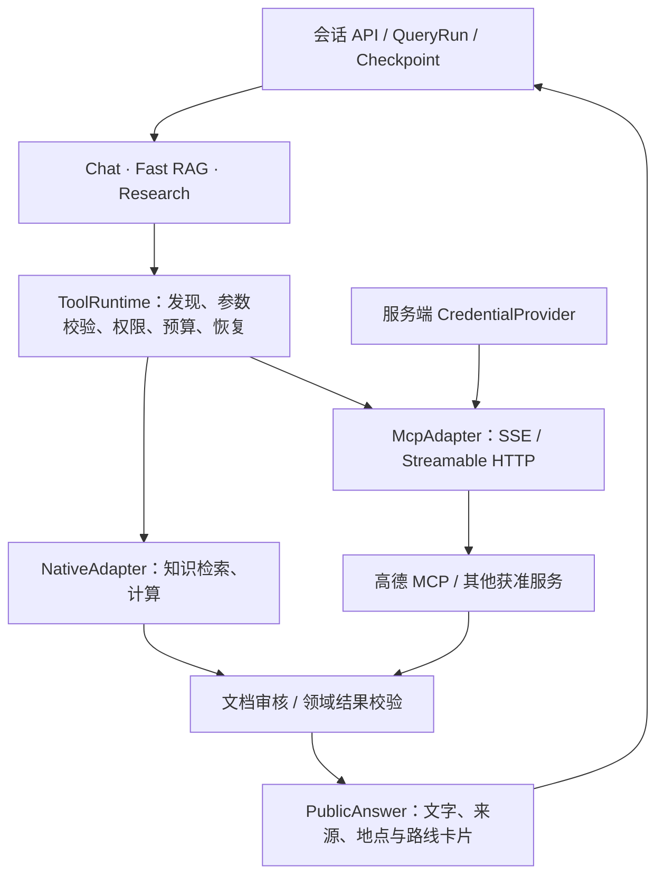

# 统一工具发现与执行层及高德 MCP 接入设计

日期：2026-10-02。用户已批准在 main 开发，要求先保存设计再实施。

## 目标与已确认体验

Chat、Fast RAG、Research 共用固定 ToolRuntime 层。模型渐进式发现和调用能力；原生 Tool 与 MCP 是该层的适配器，不增加 MCP 路由。首个外部服务为高德。聊天保留多轮上下文，地点/路线卡片附高德链接，详情按需展开；执行期间只显示阶段，最终结果校验后一次发布。会话按 user_id + session_id 隔离，长期记忆继续按 user_id 隔离。

首期交付统一目录、原生检索和计算适配器、只读 MCP SDK 客户端、平台 Bearer/Header 凭据、渐进式调用、三策略接入、异构结果校验、持久化恢复和地图卡片。用户 OAuth、写工具、跨进程配额协调保留接口和明确限制，不开放未实现能力。

## 分层

会话 API → 已有 QueryRun/Worker/Checkpoint → chat / fast_rag / research → 共享 ToolRuntime → 原生适配器或 MCP 适配器。三策略最终汇入按来源检查的回答发布边界。

ToolRuntime 是 Worker 进程内模块，由 query_composition 创建、注入和关闭。现有检索的召回、重排、权限检查、证据裁剪逻辑保留；通过原生适配器调用。Research 现有 todo/检索/计算能力继续可用，不因接入 MCP 失去恢复或文档审核能力。



路由评估同时表达需求来源和任务复杂度；外部能力摘要来自受控服务注册表。是否使用地图由执行中的工具发现决定，不根据服务名选择新的图分支。未知能力不能冒充地图能力，未授权、不可用与没有匹配工具分开处理。

## 工具运行时契约

模块位于 `src/agentic_rag/tool_runtime/`。

- `ToolDefinition`：tool_id、adapter_id、name、description、input_schema、version、source_kind（document/external/calculation）、capabilities；服务端只允许经过批准的只读工具。
- `ToolContext`：不可变 scope: UserScope、run_id、session_id、snapshot: RuntimeConfigSnapshot、deadline（Unix seconds）。全部由服务端构造。
- `ToolResult`：call_id、tool_id、source_kind、status（success/error）、data: dict、observed_at（ISO 时间）、error_code、retryable。不携带鉴权信息或客户端对象。
- `ToolAdapter`：`async list_tools(context) -> tuple[ToolDefinition,...]`、`async call_tool(definition, arguments, context) -> dict`。适配器抛出结构化 ToolError，不回传原始异常中的请求头。
- `ToolRuntime(adapters, store, limits)`；`async discover(query, context, limit=5)` 返回少量定义；`async describe(tool_id, context)` 解析已知工具；`async call(tool_id, arguments, context, call_id)` 校验并执行；`async aclose()` 关闭自有资源。

工具 ID 带命名空间，例如 `local.knowledge_search`、`local.calculator`、`mcp.amap_maps.<remote_name>`。调用参数不能指定用户身份、凭据或预算。JSON Schema 在调用前校验，未知/未批准工具在访问上游前拒绝。

原生知识库工具 data 为 `{batch: EvidenceBatch 的 JSON}`；计算工具为 `{value: ...}`。MCP data 为 `{structured: object|null, text: str, arguments: 已校验业务参数}`，同时限制载荷大小；领域适配器再解释高德数据，不把高德字段写进协议客户端。

## 渐进式发现

模型初始只看到精简能力摘要和 discover_tools/call_tool 动作协议。discover_tools 从当前作用域可见目录中筛选，返回至多 5 个工具及完整参数 Schema；随后模型填参调用。发现、模型决策、物理工具调用分别计数。Schema 版本绑定调用记录，缓存刷新或权限撤销后重新校验。

初期采用名称、能力标签及描述匹配，不额外引入向量库依赖。发现未命中允许有限扩大范围。每次发现/解析重新获取可见目录和凭据，首期不启用跨请求目录缓存；返回数量、说明长度和 Schema 大小有上限。相关服务鉴权失败不会伪装成无匹配结果，本地匹配仍可独立使用。远端工具自动发现不等于自动准许执行。远端描述和结果都是不可信数据。

## 策略与预算

三策略使用同一工具权限与执行入口。Chat 有少量动作，Fast RAG 有界获取证据，Research 允许多步探索。升级到 Research 时保留 Run ID、结果和累计预算。不能借升级或重试重置总预算。技术错误不能通过切换策略绕过权限。

默认每个 Run 最多 12 次物理工具调用、4 次发现；每次工具调用最多 20 秒，总时间不得超过 Run 截止时间。Chat、Fast RAG 分别在有限决策次数后升级 Research；Research 达到总动作限制后安全结束。原生检索的已存在超时与证据预算继续生效。每服务/每凭据有并发限制，MCP 不可用不能阻止本地工具与其他服务使用。

## 调用恢复

InvocationStore 使用 SQLite（与现有单 Worker 部署一致）持久化运行预算及调用记录。调用键为 user_id + run_id + call_id，保存 session_id、工具/定义版本、参数摘要、状态、结果和截止时间，不保存密钥。调用 ID 由服务端稳定生成，同一 ID 的参数发生变化必须拒绝。

成功结果在同一 Run 内可复用，读取时仍校验作用域和授权；运行中调用的重复提交不并发重放。只读不确定调用在截止/租约边界后可以受控重试；写工具默认禁用，不能声称跨网络恰好一次。Worker 关闭、失去租约或子任务超时引发的任务取消只撤销本次调用 token、释放租约，保留预算及截止时间，不永久取消同一 Run。用户取消沿用持久化 QueryRun 终态与发布 fencing；调用日志另提供显式 cancel_run 门禁。远端是否终止不做无法保证的承诺。

Checkpoint 仅保存 JSON 状态、已发现定义、结果引用和模型观察。客户端、连接、secret、锁不进入 Checkpoint。Run 已结束或 Worker 失去租约时，沿用已有发布 fencing，迟到结果不能覆盖终态。

## MCP 及鉴权

高德配置使用用户指定 SSE URL `https://dashscope.aliyuncs.com/api/v1/mcps/amap-maps/sse`，Header 为 `Authorization: Bearer <从 DASHSCOPE_API_KEY 读取>`。真实密钥只保存于 git 忽略的本地凭据配置，任何设计、测试、日志、快照均不能包含它。

MCP SDK 固定为 `mcp==1.26.0`；支持 SSE 和 Streamable HTTP。实际端点、Key 有效性与工具目录已通过只读联调确认，不通过替换 URL 后缀猜测端点。每次目录/工具操作独立建立 SDK session，优先保证用户、凭据轮换和 AnyIO 生命周期隔离；连接复用留待后续在压力验证后优化。

服务配置由 Settings 管理：enabled、id、url、transport、credential_ref、auth type、工具 allowlist、capabilities、timeouts。配置与凭据分离。凭据提供器实现 none/bearer/header，未来可注册 OAuth/签名提供器；未知 auth 类型启动校验明确拒绝。连接按受控目标地址建立，禁用跨来源重定向，SSE 后续发送端点也需校验；Headers 对每个需要鉴权的请求生效。

MCP 服务故障只使该服务不可用；401/403 不盲目重试。适配器不暗中重试；429/临时错误返回 retryable，后续动作或恢复重试仍消耗同一预算。未来个人 OAuth 必须先有真实登录身份；当前 default_user_id 不能替代多人登录鉴权。

## 结果、审核与前端

保留文档证据，新增外部事实与计算结果。文档继续使用现有访问授权、引用和忠实度审核。地图结果的字段、单位、坐标、时间与来源经过领域校验；卡片由后端结构化数据生成。模型不得编造地点、距离、耗时或高德 URL。

首期地图事实使用工具返回字段生成可追溯的文字及卡片；模型可选择相关结果，不能将无依据的自由文本标为已校验。混合回答先完成文档审核，再合并经过校验的外部结果；若关键来源缺失必须说明不完整或澄清。

PublicAnswer 保留三种 route，增加 `tool_audited: true|null`、`external_sources`、`cards`。文档审核标记仍仅表示文档审核；有工具结果的 Chat 也必须经过工具校验。旧消息继续可读。外部来源包含 id、tool_id、provider、observed_at；卡片使用 place/route 类型，字段受限，链接仅允许验证过的高德 HTTPS 地址。

公开卡片契约：id、kind(place|route)、title、source_id、url；place 可有 poi_id、address、location、distance_m；route 可有 origin、destination、mode、distance_m、duration_s。location 使用 `经度,纬度` 并明确 GCJ-02；origin/destination 使用结构化地点。仅有 POI ID 时使用官方 marker?poiid 链接；地理编码没有完整地址时不编造门牌。未返回字段不补造。更详细的安全字段可作为 details 展开，原始 MCP payload 不进入 DOM。

`query/tool_answers.py` 提供 `build_tool_answer(results, *, route, document_answer=None, max_cards=8) -> dict|None`：输入 ToolResult 序列，输出允许公开的确定性结果；无可解释成功结果返回 None。模型 finish 动作可选择已存在的结果调用 ID 和显示数量，不能改写事实；卡片和摘要同步裁剪。必要的外部结果必须先通过领域校验，不能仅凭协议成功发布文档部分。

地点引用写入公开结果，ConversationReader 只从同用户同 Session 已完成轮次加载有限地点上下文，保留可见序号、POI ID 和坐标，以支持“第二个”“那里”等指代。已有 POI ID 的详情追问优先按 ID 查询。新增 MCP 服务可复用协议、鉴权、预算与恢复层；如果要把新服务结果公开给用户，还需接入其领域校验器和公开来源契约，未适配的原始输出不会自动公开。

## 配置与运行边界

`.env.example` 提供全部开关。高德启用需要 `AGENTIC_RAG_AMAP_MCP_ENABLED=true` 和本地 `DASHSCOPE_API_KEY`。统一层默认启用，本地工具无需地图凭据；高德默认关闭。变更后重启 API/Worker，使能力摘要和配置指纹保持一致。

其他服务通过 `AGENTIC_RAG_MCP_SERVERS` 的 JSON 数组注册，例如以下配置只引用环境变量名，不包含密钥：

```json
[{"enabled":true,"id":"example","url":"https://mcp.example.com/mcp","transport":"streamable_http","auth_type":"header","credential_ref":"env:EXAMPLE_MCP_KEY","header_name":"X-API-Key","allowed_tools":["search"],"capabilities":["example.search"]}]
```

通用环境凭据需要由部署环境注入；服务端提供器按注册服务绑定解析。`auth_type=none` 不创建凭据绑定；未实现的 OAuth 配置会明确拒绝。每服务配置并发上限；当前平台密钥与服务一一绑定，因此该上限也约束该服务所用密钥。跨服务共享同一密钥的聚合限流、多个 Worker/主机的分布式配额和用户 OAuth 尚未实现。

## 验证与发布

测试包含作用域/凭据隔离、参数拒绝、取消/超时/重复调用、预算恢复、工具目录变化、MCP 协议鉴权、三策略发现调用、跨来源审核、旧消息兼容、链接安全、多轮指代和多标签页状态回归。使用本地 MCP fixture 测试协议，真实高德只做必要的只读联调，不把凭据写入 fixture。

新能力可配置关闭；未配置服务时原有 Chat/RAG 能正常工作。配置/Prompt/实现指纹纳入 Run 快照；新增字段保持旧 Checkpoint 可读。完成后运行完整默认测试、相关类型与静态检查、浏览器卡片验证，并记录外部服务联调结果和无法验证的项目。

## 依据

- https://modelcontextprotocol.io/specification/2025-11-25/server/tools
- https://modelcontextprotocol.io/specification/2025-11-25/basic/authorization
- https://help.aliyun.com/zh/model-studio/mcp-external-calls
- https://help.aliyun.com/zh/compute-nest/use-cases/agent-connection-instructions
